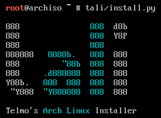

# TALI (Telmo's Arch Linux Installer)



## Setup

First of all, boot your [Arch Linux live CD](https://www.archlinux.org/download/).

You'll need an internet connection to use this script, if you need to use Wi-Fi type `iw dev` to find your Wi-Fi interface name and then `wifi-menu -o INTERFACE_NAME` to connect.

Then, download the script and run it:

```
loadkeys br-abnt2
pacman -Sy git --noconfirm
git clone https://github.com/telmotrooper/tali
tali/install.py
```
